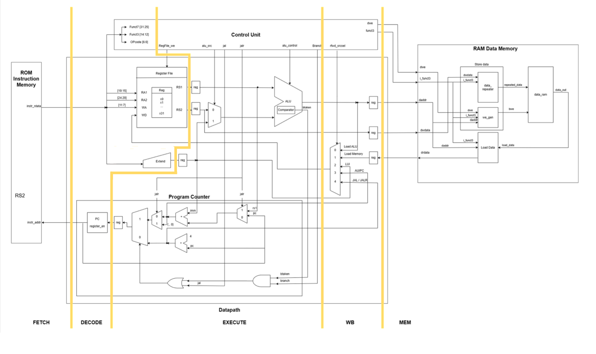

I change Single-Cycle to Multi-Cycle 

5 STAGE 
FETCH > DECODE > EXECUTE > MEMORY > WRITEBACK 

First, i change cpu code. it was combinational logic. but we need sequential logic to make Multi Cycle. 
Then we can divide the instruction to several clks. 

I add total 7 register to make Multi Cycle. 

Between Decode and Execute: RS1, RS2, Immediate save registers (3) 
Between Execute and Memory: ALU_RESULT, RS2 save registers (2) 
Between Memory and Write Back: DRDATA save register (1) 
PC path: PC_NEXT save register (1), and the PC register was changed to an enable-controlled register using pc_en 

A single-cycle processor completes one instruction in one clock cycle, so the clock period must be long enough for the entire path from Fetch to Write Back. 
In a multi-cycle processor, the instruction execution process is divided into several clock cycles, which reduces the combinational logic delay in each cycle.
Therefore, the clock period can be shorter and the clock frequency can be higher.
However, because each instruction takes multiple cycles, the overall performance depends on the instruction mix and implementation. 

So, we compare the two types using C code SUM.
Single cycle : 15.8ns clock period, simulation time=4.447us
Multi cycle : 8.3ns clock period, simulation time=9.084us

